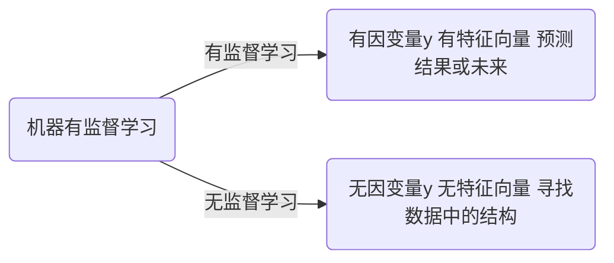

# 1 导论

## **1.1 什么是机器学习？**

​		机器学习的一个重要目标就是利用数学模型来理解数据，发现数据中的规律，用作数据分析和预测。

### **1.1.1 数据？**

​		数据通常由一组向量组成，这组向量中的每一个向量都是一个样本，我们用$x_{i}$来表示一个样本，其中$i = 1,2,3...N$，共$N$个样本。每个样本$x_{i} = \left ( x_{i1},x_{i2}...x_{ip},y_{i} \right )$共$p+1$个维度，$ x_{i1},x_{i2}...x_{ip} $称为特征，$y_{i}$称为因变量或者响应变量。特征用来描述影响因变量$y_{i}$的因素。例如，我们要探寻身高是否会影响体重的关系的时候，身高就是一个特征，体重就是因变量。

​		通常在一个数据表$dataframe$里面，一行表示一个样本$x_{i}$，一列表示一个特征。

​		对数据形式的约定：

- 第$i$个样本：$x_{i} = \left ( x_{i1},x_{i2}，...，x_{ip},y_{i} \right )^{T}$，$i = 1,2,3...N$
- 因变量$y = \left ( y_{1}, y_{2}，...，y_{N}\right )^{T}$
- 第$k$个特征：$x^{\left ( k \right )} = \left ( x_{1k}, x_{2k} ,..., x_{Nk}  \right )^{T}$
- 特征矩阵$X = \left ( x_{1},x_{2}，...，x_{N} \right )^{T}$

### **1.1.2 有监督学习和无监督学习**

​		根据数据是否有因变量，机器学习的任务可分为：有监督学习和无监督学习。

- 有监督学习：给定某些特征去估计因变量，即因变量存在的时候，我们称这个机器学习任务为有监督学习。例如，我们用房间面积、房屋所在地区、环境等级等因素去预测某个地区的房价。

  根据因变量是否连续，有监督学习分为回归和分类。

  ```mermaid
  
  graph LR
  
  A(有监督学习) -->|回归| C(因变量y是连续型变量 如房价体重)
  A(有监督学习) -->|分类| D(因变量y是离散型变量 如西瓜是好瓜还是坏瓜)
  
  ```

- 无监督学习：给定某些特征，但不给定因变量。建模的目的是学习数据本身的结构和关系。例如，我们给定某电商用户的基本信息和消费记录，通过观察数据中的哪些类型的用户 彼此间的行为和属性类似，形成一个客群。注意，我们本身并不知道哪个用户属于哪个客群，即没有给定因变量。




# **2 使用sklearn构建完成的机器学习项目流程**

​		一般来说，一个完整的机器学习项目分为以下步骤：

​	（1）明确项目任务：回归/分类

​	（2） 收集数据集并选择合适的特征

​	（3） 选择度量模型性能的指标

​	（4） 选择具体的模型并进行训练以优化模型

​	（5）评估模型的性能并调参

## 2.1 使用sklearn构建完整的回归项目

（1）  回归问题

（2）  收集数据集并选择合适的特征：

​			我们使用Boston房价数据集的原因：

（3）  选择度量模型性能的指标：

​			MSE均方误差：$MSE\left ( y,\hat{y} \right ) = \frac{1}{n_{samples}}\sum_{i=0}^{n_{samples-1}}\left ( y_{i}-\hat{y_{i}} \right )^{2}$
​			MAE平均绝对误差：$MAE\left ( y,\hat{y} \right ) = \frac{1}{n_{samples}}\sum_{i=0}^{n_{samples-1}}\left | y_{i}-\hat{y_{i}} \right |$

​			$R^{2}$决定系数：$R^{2}\left ( y,\hat{y} \right ) = 1 - \frac{\sum_{i=1}^{n}\left ( y_{i}- \hat{y_{i}}\right )^{2}}{\sum_{i=1}^{n}\left ( y_{i}- \bar{y}\right )^{2}}$

​			解释方差得分：$ExplainedVariance\left ( y,\hat{y} \right ) = 1 - \frac{Var\left \{ y-\hat{y} \right \}}{Var\left \{ y \right \}}$

（4）选择具体的模型并进行训练

​		回归分析时一种预测性的建模技术，它研究的是因变量(目标)和自变量(特征)之间的关系。这种技术通常用于预测分析，时间序列模型以及发现变量之间的因果关系。通常使用曲线/线来拟合数据点，目标是使曲线到数据点的距离差异最小。

**线性回归模型：**

​		线性回归是回归问题的一种，线性回归假设目标值与特征之间线性相关，即满足一个多元一次方程。通过构建损失函数，来求解损失函数最小时的参数w。

**数据集：**

$D = \left \{ \left ( x_{1},y_{1} \right ),..., \left ( x_{N},y_{N} \right ) \right \} ,  x_{i}\epsilon R^{p},  y_{i} \epsilon R,i = 1,2,...,N$  

$X = \left ( x_{1},x_{2},...,x_{N}  \right ) ^{T}$

$Y = \left ( y_{1},y_{2},...,y_{N}  \right ) ^{T}$

​		假设X和Y之间存在线性关系，模型的具体形式为：$\hat{y} = f\left ( w \right ) = w^{T}x$，行向量x列向量=值，所以预测值y往往是一个数字。

**最小二乘估计：**

​		我们需要衡量真实值$y_{i}$与线性回归模型的预测值$w^{T}x$之间的差距，在这里我们使用二范数的平方和L(w)来描述这种差距：

$L(w) = \sum_{i}^{N}\left \| w^{T}x_{i} -y_{i}\right \|_{2}^{2}$
          $=\sum_{i}^{N}\left (w^{T}x_{i} -y_{i}  \right )^{2}$
          $=\left ( w^{T} X^{T} - Y^{T}\right )\left ( w^{T} X^{T} - Y^{T}\right )^{T}$
          $= w^{T}X^{T} Xw-2w^{T}X^{T}Y+YY^{T}$

Tips：为什么平方和不用绝对值？因为绝对值没法求导。

因此，我们需要找到$L(w)$最小时对应的参数$w$，即：$\hat{w}=argminL(w)$，即转化为求解最小化$L(w)$的问题。

求导

 令：$\frac{\partial L(w)}{\partial w}$$=2X^{T}Xw - 2X^{T}Y$$= 0$

因此：$\hat{w}=\left (X^{T}X  \right )^{-1}X^{T}Y$

**几何解释：**

​		向量a和向量b互相垂直，则$\left \langle a,b \right \rangle = a^{T}b = 0$

​		平面X的法向量$Y-Xw$与平面$X$互相垂直，因此$X^{T}(Y-Xw)=0$，即：$\hat{w}=\left (X^{T}X  \right )^{-1}X^{T}Y$

​		

**概率视角：**


# 3 作业

## 3.1 请详细阐述线性回归模型的最小二乘法表达。

**最小二乘估计：**

​		我们需要衡量真实值$y_{i}$与线性回归模型的预测值$w^{T}x$之间的差距，在这里我们使用二范数的平方和L(w)来描述这种差距：

$L(w) = \sum_{i}^{N}\left \| w^{T}x_{i} -y_{i}\right \|_{2}^{2}$
          $=\sum_{i}^{N}\left (w^{T}x_{i} -y_{i}  \right )^{2}$
          $=\left ( w^{T} X^{T} - Y^{T}\right )\left ( w^{T} X^{T} - Y^{T}\right )^{T}$
          $= w^{T}X^{T} Xw-2w^{T}X^{T}Y+YY^{T}$

Tips：为什么平方和不用绝对值？因为绝对值没法求导。

因此，我们需要找到$L(w)$最小时对应的参数$w$，即：$\hat{w}=argminL(w)$，即转化为求解最小化$L(w)$的问题。

求导

 令：$\frac{\partial L(w)}{\partial w}$$=2X^{T}Xw - 2X^{T}Y$$= 0$

因此：$\hat{w}=\left (X^{T}X  \right )^{-1}X^{T}Y$

## 3.2 在线性回归模型中，极大似然估计与最小二乘估计有什么联系和区别？

[(12条消息) 最大似然估计和最小二乘估计的区别与联系_梦想腾飞-CSDN博客_极大似然估计和最小二乘估计的区别](https://blog.csdn.net/xidianzhimeng/article/details/20847289)

[(12条消息) 最大似然估计(MLE)与最小二乘估计(LSE)的区别_你若盛开，清风自来-CSDN博客](https://blog.csdn.net/u010161630/article/details/52012756?utm_medium=distribute.pc_relevant.none-task-blog-baidujs_baidulandingword-1&spm=1001.2101.3001.4242)

## 3.3 为什么多项式回归在实际问题中的表现经常不是很好？

​		当阶数越高，多项式的曲线越光滑，在数据点较少的边界波动较大，边界数据的预测精确度较低。

## 3.4 决策树模型与线性模型之间的联系与区别？

## 3.5 什么是KKT条件？

KKT(最优解的一阶必要条件)


## 3.6 为什么要引入原问题的对偶问题？

​		因为原问题与对偶问题就像是一个问题两个角度去看，如利润最大与成本最低等。有时侯原问题上难以解决，但是在对偶问题上就会变得很简单。再者，任何一个原问题在变成对偶问题后都会变成一个凸优化的问题，

## 3.7 使用CH1机器学习数学基础所学的内容，找到一个具体的数据集，使用线性回归模型拟合模型，要求不能使用sklearn，只能使用python和numpy。

波士顿房价预测

```python
def openFileAndSplit():
    # 打开并且分割字符

    with open(r"F:\housing_data.txt", 'r') as f:

        for line in f.readlines():
            b = []
            for x in line.split():
                b.append(float(x))
            a.append(b)
            
def duoyuanxianxinghuigui():
    # 多元线性回归模型
    b = []
    # 分离最后一列
    for l in a:
        b.append([l.pop()])
        l.append(1)
    a1 = np.mat(a[0:449])
    a2 = np.mat(a[450:505])
    b1 = np.mat(b[0:449])
    b2 = np.mat(b[450:505])
    k = np.matmul(a1.transpose(1, 0), a1).I
    k = np.matmul(np.matmul(k, a1.transpose(1, 0)), b1)
    ans = np.matmul(a2, k).transpose(1, 0)
    # 均方差计算准确率
    accuRate = np.array(ans - b2.transpose(1, 0))[0]
    print(ans)
    print("准确率：")
    print(sum(accuRate * accuRate) / len(accuRate))


def main():
    openFileAndSplit()
    duoyuanxianxinghuigui()


main()
```


